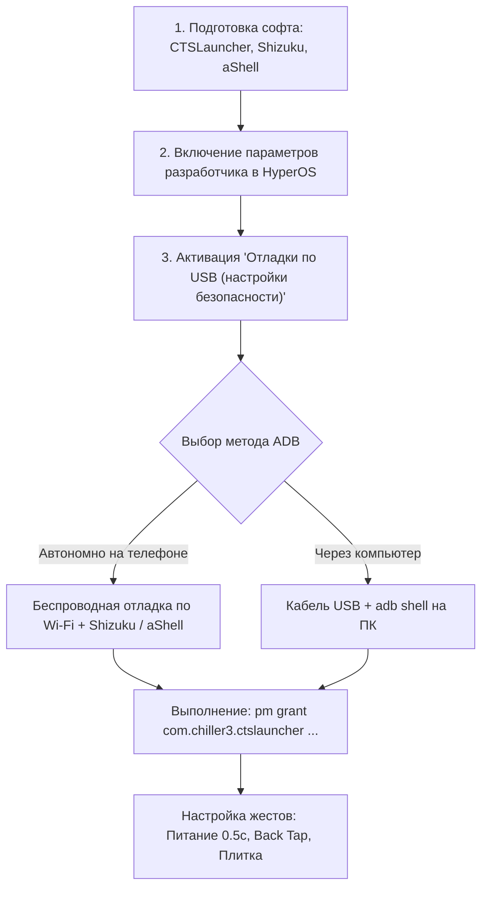
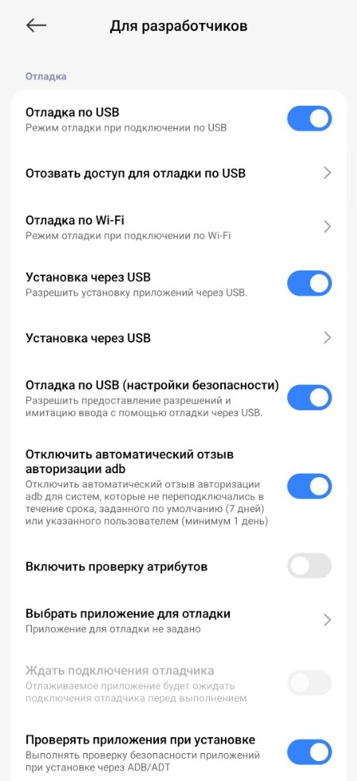
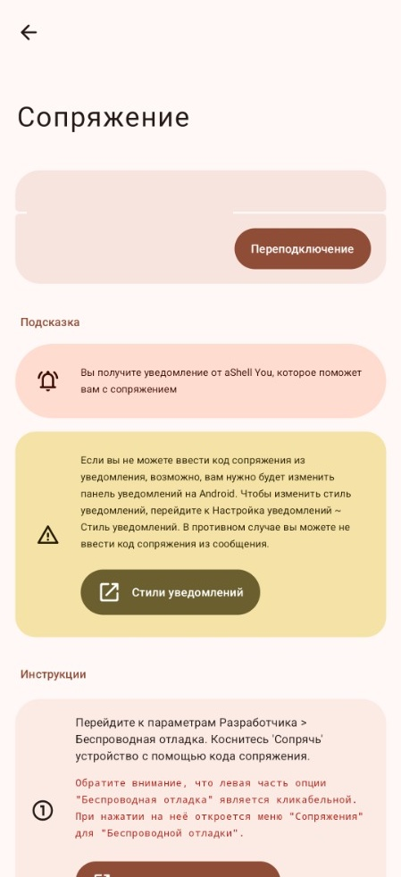
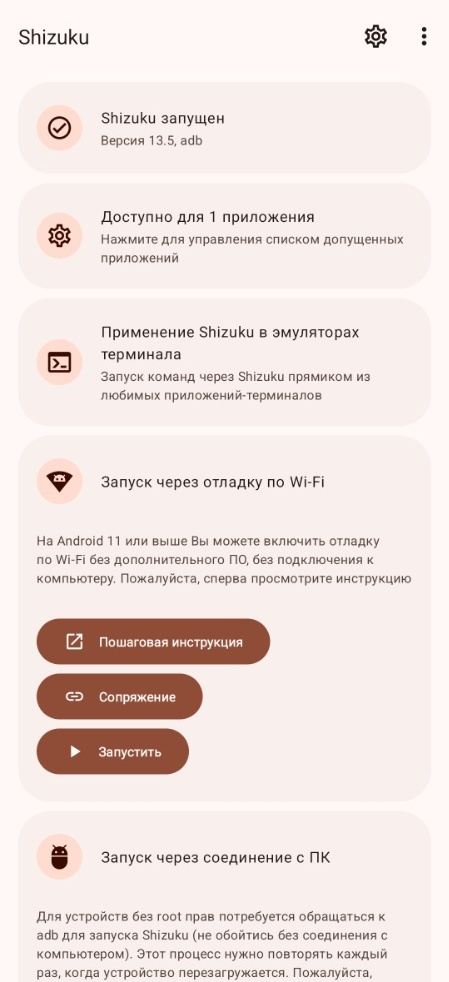
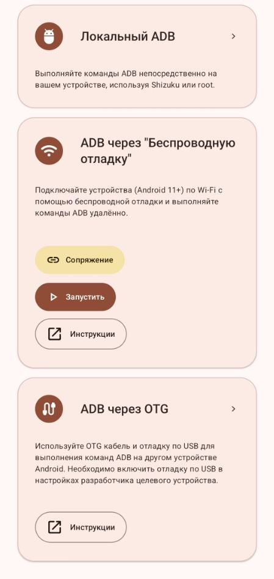
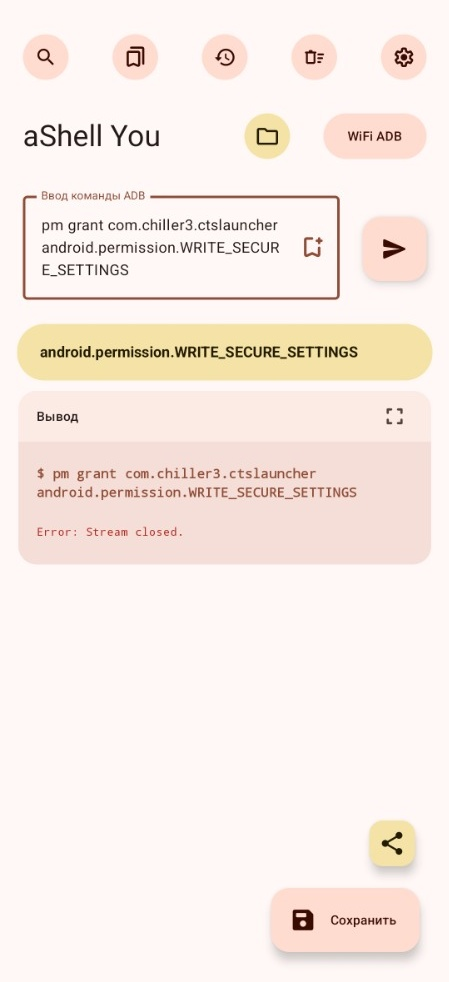

# Circle to Search on Android & HyperOS via ADB

Корпорация Google начала удалять старого классического Google Assistant из нативного приложения Google и вместо него принудительно даёт урезанного ассистента Gemini, из-за чего пользователи потеряли привычные быстрые фичи контекстного поиска по экрану. 

Официально инновационная функция **Circle to Search** доступна исключительно на флагманах **Google Pixel** и **Samsung Galaxy**. Однако с помощью этой инструкции и утилиты CTSLauncher мы активируем Circle to Search абсолютно нативно на любом смартфоне (Xiaomi, POCO, Redmi, Motorola и др.) без смены прошивки и без Root-прав.

С помощью ADB мы возвращаем полноценный нативный **Circle to Search** (мгновенный перевод всего экрана, распознавание любого текста и выделение объектов произвольной формы) через удержание кнопки питания (0.5 сек), двойное постукивание по задней панели (Back Tap) или плитку в шторке быстрых настроек.

---

## 1. Саммари (TL;DR)

- **Проблема:** Google форсирует переход на Gemini, урезая классический контекстный поиск экрана («Что на экране?», выделение текста, перевод). На большинстве смартфонов (Xiaomi, POCO, Redmi, Motorola и др.) нативный жест Circle to Search скрыт или отсутствует в системных настройках.
- **Решение:** Механизм контекстного поиска физически встроен в само приложение Google. Утилита с открытым исходным кодом **CTSLauncher** (`com.chiller3.ctslauncher`) отправляет системный интент на запуск активности `Contextual Search / OpenAssistActivity`.
- **Автономия без ПК:** Все команды выдаются прямо на самом телефоне через связку **Беспроводная отладка (Wireless Debugging) + Shizuku + aShell** (или Termux).
- **Критический нюанс HyperOS / MIUI:** Выдача разрешения `WRITE_SECURE_SETTINGS` без активации пункта **«Отладка по USB (настройки безопасности)»** приводит к аварийному разрыву соединения: `Error: Stream closed`.

---

## 2. Список пунктов (План действий)



1. **Загрузка и установка:**
   - [CTSLauncher APK (GitHub chenxiaolong/CTSLauncher)](https://github.com/chenxiaolong/CTSLauncher/releases)
   - [Shizuku (Google Play / GitHub)](https://github.com/RikkaApps/Shizuku/releases)
   - [aShell You (F-Droid / GitHub)](https://github.com/DP-Hridayan/aShellYou/releases) или Termux.
2. **Активация режима разработчика и прав безопасности в HyperOS.**
3. **Сопряжение ADB (по Wi-Fi автономно или через USB с ПК).**
4. **Выдача системного разрешения `WRITE_SECURE_SETTINGS`.**
5. **Настройка вызова:** кнопка питания (0.5 сек), стук по спинке (Back Tap), шторка быстрых настроек.
6. **Тестирование Circle to Search.**

---

## 3. Подробный гайд

### Способ 1: Автономно на смартфоне через Wi-Fi (без ПК)

Этот способ позволяет настроить всё непосредственно на телефоне, находясь в любой сети Wi-Fi (или мобильной точке доступа).

#### Шаг 1. Настройки разработчика
1. Откройте *Настройки -> О телефоне* и нажимайте на пункт **Версия ОС (HyperOS / MIUI)** 7 раз, пока не появится сообщение «Вы стали разработчиком!».
2. Перейдите в *Настройки -> Расширенные настройки -> Для разработчиков*.
3. Активируйте переключатели:
   - **Отладка по USB**
   - **Отладка по Wi-Fi** (Беспроводная отладка)
   - **Отладка по USB (настройки безопасности)** *(Обязательно для Xiaomi/HyperOS! См. раздел решения ошибок)*.



---

#### Шаг 2. Сопряжение по Wi-Fi
1. Зайдите в пункт **Отладка по Wi-Fi** и нажмите **«Подключить устройство с помощью кода сопряжения»**.
2. Появится всплывающее окно с 6-значным Wi-Fi кодом и портом подключения.
3. Откройте **aShell** или шторку уведомлений Shizuku и введите код сопряжения.



---

#### Шаг 3. Запуск Shizuku
1. Откройте приложение **Shizuku**.
2. В блоке *«Запуск через отладку по Wi-Fi»* нажмите **Запустить** (Start).
3. Убедитесь, что статус изменился на **«Shizuku запущен» (Shizuku is running)**.
4. В разделе *«Авторизованные приложения»* предоставьте доступ приложению **aShell** (или настройте мост `rish` в Termux).



---

#### Шаг 4. Выполнение команды в aShell / Termux
1. Запустите **aShell You**.
2. На главном экране выберите карточку **«Локальный ADB» (Local ADB)** и нажмите кнопку **«Начать»** (Start).



> [!IMPORTANT]
> **Куда именно нажимать:** Выбирайте строго первую карточку **«Локальный ADB»** (через Shizuku). Не нажимайте «Беспроводная отладка» внутри aShell — поскольку мы уже активировали Shizuku на Шаге 3, локальный режим мгновенно предоставит терминал без повторного сопряжения, кодов и портов!

3. В открывшейся строке терминала введите команду выдачи разрешения для CTSLauncher и нажмите **Enter (Выполнить)**:

```bash
pm grant com.chiller3.ctslauncher android.permission.WRITE_SECURE_SETTINGS
```

> [!TIP]
> Команда выполняется без вывода текста при успехе (код возврата `0`). Если ошибок нет — право успешно предоставлено!

---

### Способ 2: Через компьютер (кабель USB)

Если телефон подключён к ПК или беспроводная отладка недоступна:

1. Включите **«Отладка по USB»** и **«Отладка по USB (настройки безопасности)»** в настройках разработчика.
2. Подключите смартфон к ПК кабелем. На экране телефона появится запрос: *«Разрешить отладку по USB с этого компьютера?»* — поставьте галочку «Всегда разрешать» и нажмите **ОК**.
3. На компьютере откройте терминал (PowerShell / Командная строка / Terminal) и выполните:

```bash
# Проверка видимости устройства
adb devices

# Выдача разрешения CTSLauncher
adb shell pm grant com.chiller3.ctslauncher android.permission.WRITE_SECURE_SETTINGS
```

---

### Разбор критической ошибки: `Error: Stream closed`

Если при вводе команды в aShell или терминале вы видите ошибку:

```text
$ pm grant com.chiller3.ctslauncher android.permission.WRITE_SECURE_SETTINGS
Error: Stream closed.
```



#### Почему это происходит:
В прошивках **Xiaomi HyperOS и MIUI** встроен усиленный контур безопасности (компонент `com.miui.securitycenter`). По умолчанию системный демон ADB имеет право читать логи и устанавливать APK, но **любая попытка изменить защищенные настройки системы или выдать права уровня `WRITE_SECURE_SETTINGS` блокируется ядром безопасности**, которое принудительно обрывает сокет соединения (Stream closed).

#### Пошаговое исправление:
1. **Вставьте физическую SIM-карту** в телефон и убедитесь, что включен мобильный интернет (это обязательное требование безопасности Xiaomi для валидации Mi-аккаунта).
2. **Войдите в Mi Аккаунт** в системных настройках телефона.
3. Откройте *Настройки -> Расширенные настройки -> Для разработчиков*.
4. Включите пункт **«Отладка по USB (настройки безопасности)»** (USB debugging (Security settings)).
5. Система покажет 3 последовательных окна с предупреждениями безопасности с 5-секундным таймером на каждом шаге. Нажмите **«Далее»**, затем **«Принять»**.
6. Вернитесь в aShell / Termux и повторите команду:
   ```bash
   pm grant com.chiller3.ctslauncher android.permission.WRITE_SECURE_SETTINGS
   ```
   *Теперь команда пройдёт мгновенно без закрытия потока.*

---

## 4. Настройка аппаратных жестов вызова

После выдачи разрешения вы можете настроить мгновенный вызов Circle to Search тремя удобными способами:

### 1. Удержание кнопки питания (0.5 сек)
Идеальная замена долгому удержанию кнопки «Домой» на смартфонах с жестовой навигацией:
1. Откройте *Настройки -> Расширенные настройки -> Функции жестов -> Запуск Google Ассистента* (или *Нажатие кнопки питания*).
2. Включите опцию: **«Удерживайте кнопку питания 0.5 с»**.
3. В *Настройки -> Приложения -> Приложения по умолчанию -> Цифровой ассистент* (Assist & voice input):
   - Выберите **CTSLauncher** в качестве основного цифрового ассистента.
   - Либо оставьте Google/Gemini, если в настройках CTSLauncher включена опция авто-переключения ассистента (*Auto-switch assistant app*).

### 2. Стук по крышке (Back Tap)
Активация контекстного поиска постукиванием пальцем по задней панели смартфона:
1. Откройте *Настройки -> Расширенные настройки -> Функции жестов -> Постукивание по задней панели* (Back tap).
2. Выберите **Двойное постукивание** (или Тройное).
3. В списке доступных действий выберите **CTSLauncher** (или «Запуск Google Ассистента»).

### 3. Плитка в шторке быстрых настроек (Quick Settings Tile)
1. Смахните шторку быстрых настроек вниз и нажмите иконку редактирования плиток (карандаш или «+»).
2. Найдите плитку **Circle to Search** (или **CTS**) и перетащите её в активную область переключателей.
3. Теперь при нажатии на плитку из любого приложения или игры экран зафиксируется и запустится оверлей Circle to Search.

---

### ⚠️ Почему не сработал свайп из нижнего угла (по диагонали)?

Многие пользователи привыкли вызывать ассистента диагональным свайпом из нижнего угла экрана. В ходе наших практических тестов и анализа выяснилось:
* В HyperOS и POCO Launcher диагональный угловой свайп жёстко привязан к системному голосовому компоненту `voice_interaction_service`.
* Приложение **CTSLauncher** является стандартной активностью Android (`Activity`), а не голосовой службой, поэтому SystemUI не может запустить его напрямую через этот конкретный жест.
* Попытки принудительно подменить сервис голосового ввода через скрытые параметры `settings secure` ломают симметрию жестов и вызывают сбои навигации.

Именно поэтому мы используем **три проверенных и 100% стабильных решения**:
1. **Удержание кнопки питания 0.5 с** (вызывает стандартный интент `ASSIST`);
2. **Двойное постукивание по задней крышке (Back Tap)**;
3. **Плитку в шторке быстрых переключателей**.

---

## 5. Бонус: Что ещё полезного можно сделать через ADB

Раз уж у вас настроен доступ к ADB через Shizuku / aShell / Termux, воспользуйтесь проверенными твиками для оптимизации смартфона:

### 1. Debloat: Удаление рекламы и телеметрии Xiaomi без Root
Удаление предустановленного рекламного мусора для текущего пользователя:

```bash
# Рекламный демон MIUI (MSA)
pm uninstall -k --user 0 com.miui.msa.global

# Системная аналитика и слежка
pm uninstall -k --user 0 com.miui.analytics

# Встроенный каталог GetApps
pm uninstall -k --user 0 com.xiaomi.mipicks

# Мусорные игры и сервис Game Center
pm uninstall -k --user 0 com.xiaomi.glgm

# Сборщик дампов и краш-логов
pm uninstall -k --user 0 com.miui.bugreport

# Фоновые демоны Facebook / Meta
pm uninstall -k --user 0 com.facebook.services
pm uninstall -k --user 0 com.facebook.system
pm uninstall -k --user 0 com.facebook.appmanager
```

> [!TIP]
> Для удобного визуального удаления приложений с описанием используйте приложение **Canta** (работает через Shizuku).

---

### 2. Фиксация 120 FPS без просадок до 60 Гц
Принудительно запрещает системе сбрасывать частоту обновления экрана в сторонних приложениях и браузере:

```bash
settings put system min_refresh_rate 120
settings put system user_refresh_rate 120
```

---

### 3. Отключение Joyose (снятие игрового троттлинга)
Служба `Joyose` на смартфонах Xiaomi жестко режет частоту процессора и FPS в играх (Genshin Impact, PUBG, MLBB) уже при температуре 39-40°C. Отключение снимает искусственные лимиты:

```bash
# Отключение Joyose
pm disable-user --user 0 com.xiaomi.joyose

# Включение обратно (если потребуется)
pm enable com.xiaomi.joyose
```

---

### 4. Полезные безрутовые инструменты на базе Shizuku
- **App Ops:** Тонкое управление скрытыми разрешениями (доступ к буферу обмена, фоновому запуску, датчикам движения).
- **Hail:** Заморозка редко используемых приложений в один клик без их удаления.
- **Swift Backup:** Полный бэкап приложений и их настроек без необходимости разблокировки загрузчика.
